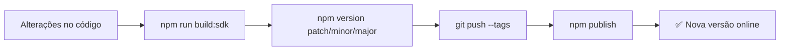

# 📦 Guia Completo: Criando e Publicando SDK no NPM

> **🎯 Objetivo**: Transformar seu Payment Widget em um pacote NPM profissional que desenvolvedores podem facilmente integrar em seus projetos React.

---

## 📋 Índice

- [🚀 Visão Geral](#-visão-geral)
- [⚙️ Pré-requisitos](#️-pré-requisitos)
- [🏗️ Estrutura do Projeto](#️-estrutura-do-projeto)
- [📦 Configuração do Package.json](#-configuração-do-packagejson)
- [🔧 Build Configuration](#-build-configuration)
- [🚀 Publicação Inicial](#-publicação-inicial)
- [📈 Versionamento](#-versionamento)
- [🧪 Testes](#-testes)
- [📖 Documentação](#-documentação)
- [🔍 Troubleshooting](#-troubleshooting)

---

## 🚀 Visão Geral

### O que você vai conseguir:

```mermaid
graph TD
    A[Seu Código React] --> B[Build do SDK]
    B --> C[Pacote NPM]
    C --> D[Cliente instala]
    D --> E[import { PaymentWidget } from 'seu-sdk']
    E --> F[<PaymentWidget config={...} />]
```

### 🎁 Benefícios para seus Clientes:

| ✅ **Vantagem** | 📝 **Descrição** |
|----------------|------------------|
| **Plug & Play** | `npm install` e pronto para usar |
| **TypeScript** | Auto-complete e type safety |
| **Tree Shaking** | Apenas o código usado é incluído |
| **Atualizações** | `npm update` para novas versões |
| **Compatibilidade** | Funciona em qualquer projeto React |

---

## ⚙️ Pré-requisitos

### 🛠️ Ferramentas Necessárias

```bash
# Verificar se tem Node.js (versão 18+)
node --version
# ✅ Deve mostrar: v18.x.x ou superior

# Verificar NPM
npm --version
# ✅ Deve mostrar: 8.x.x ou superior

# Verificar Git
git --version
# ✅ Deve mostrar: 2.x.x ou superior
```

### 📝 Conta NPM

1. **Criar conta**: https://www.npmjs.com/signup
2. **Verificar email**
3. **Login local**:
   ```bash
   npm login
   # Digite: username, password, email
   ```

---

## 🏗️ Estrutura do Projeto

### 📁 Estrutura Atual (já configurada!)

```
payment-widget-poc/
├── 📦 package.json          # ← Configuração do NPM
├── 📂 src/
│   ├── 📂 sdk/
│   │   └── 📄 index.ts      # ← Entry point do SDK
│   ├── 📂 components/
│   │   ├── 📄 payment-modal.tsx
│   │   ├── 📄 payment-widget.tsx
│   │   └── 📄 theme-provider.tsx
│   └── 📂 types/
│       └── 📄 index.ts      # ← Tipos TypeScript
├── 📂 dist/                 # ← Build outputs
│   ├── 📂 sdk/             # ← NPM package files
│   ├── 📂 cdn/             # ← CDN bundle
│   └── 📂 bootstrap/       # ← Bootstrap loader
└── 📄 vite.config.sdk.ts   # ← Build config para SDK
```

### 🎯 Entry Points

O SDK exporta os principais componentes:

```typescript
// src/sdk/index.ts
export { PaymentModal } from "../components/payment-modal";
export { PaymentWidget } from "../components/payment-widget"; 
export { ThemeProvider, useTheme } from "../components/theme-provider";
export type { WidgetAPI, WidgetConfig, WidgetState } from "../types";
```

---

## 📦 Configuração do Package.json

### ✨ Configuração Atual (já pronta!)

```json
{
  "name": "payment-widget-sdk",
  "version": "1.0.0", 
  "description": "🚀 Embeddable payment widget for React",
  
  // 📍 Entry points para diferentes módulos
  "main": "dist/sdk/index.js",        // CommonJS
  "module": "dist/sdk/index.es.js",   // ES Modules  
  "types": "dist/sdk/index.d.ts",     // TypeScript
  
  // 📦 Arquivos incluídos no pacote
  "files": [
    "dist/sdk",      // ← Código do SDK
    "dist/cdn",      // ← Bundle CDN (bonus)
    "dist/bootstrap", // ← Loader (bonus)
    "README.md",
    "LICENSE"
  ],
  
  // 🏷️ Tags para descoberta
  "keywords": [
    "payment-widget", "react", "typescript", 
    "payment-gateway", "checkout", "sdk"
  ],
  
  // 🤝 Dependências externas (não incluídas no bundle)
  "peerDependencies": {
    "react": ">=18.0.0",
    "react-dom": ">=18.0.0"
  }
}
```

### 🎨 Personalizações Importantes

```bash
# 1. Alterar nome do pacote (deve ser único no NPM)
npm search seu-nome-aqui  # Verificar disponibilidade

# 2. Ajustar no package.json:
{
  "name": "@sua-org/payment-widget",  # Com scope da org
  # ou
  "name": "seu-payment-widget-unico", # Nome único
  
  "author": "Seu Nome <email@exemplo.com>",
  "homepage": "https://seu-site.com/docs",
  "repository": {
    "type": "git", 
    "url": "https://github.com/usuario/repo.git"
  }
}
```

---

## 🔧 Build Configuration

### ⚙️ Vite Config para SDK

O arquivo `vite.config.sdk.ts` já está configurado:

```typescript
// vite.config.sdk.ts
import { resolve } from "node:path";
import react from "@vitejs/plugin-react";
import { defineConfig } from "vite";

export default defineConfig({
  plugins: [react()],
  
  build: {
    outDir: "dist/sdk",           // ← Output para NPM
    lib: {
      entry: resolve(__dirname, "src/sdk/index.ts"),
      name: "PaymentWidgetSDK",   // ← Nome global (UMD)
      fileName: (format) => `index.${format}.js`,
      formats: ["es", "umd"]      // ← ES Modules + UMD
    },
    
    // 🎯 Externals: React não é incluído no bundle
    rollupOptions: {
      external: ["react", "react-dom"],
      output: {
        globals: {
          react: "React",
          "react-dom": "ReactDOM"
        }
      }
    }
  }
});
```

### 🏗️ Comandos de Build

```bash
# Build apenas o SDK (para NPM)
npm run build:sdk

# Build completo (SDK + CDN + Bootstrap) 
npm run build

# Verificar output
ls -la dist/sdk/
# ✅ Deve ter: index.js, index.es.js, index.d.ts
```

---

## 🚀 Publicação Inicial

### 📋 Checklist Pré-Publicação

```bash
# ✅ 1. Limpar builds anteriores
rm -rf dist/ node_modules/.vite

# ✅ 2. Instalar dependências limpas  
npm ci

# ✅ 3. Build do SDK
npm run build:sdk

# ✅ 4. Verificar arquivos que serão publicados
npm pack --dry-run
```

**📊 Output esperado:**
```
npm notice === Tarball Contents === 
npm notice 1.2MB dist/sdk/index.js
npm notice 856kB dist/sdk/index.es.js  
npm notice 15.3kB dist/sdk/index.d.ts
npm notice 2.1kB README.md
npm notice 1.1kB LICENSE
```

### 🎯 Primeira Publicação

```bash
# 1. 🔐 Login no NPM (apenas uma vez)
npm login
# Digite: username, password, email, OTP

# 2. 🔍 Verificar configurações
npm whoami                    # ← Seu username
npm config get registry       # ← https://registry.npmjs.org/

# 3. 🚀 Publicar!
npm publish

# ✅ Sucesso!
# + payment-widget-sdk@1.0.0
```

### 🎉 Verificar Publicação

```bash
# Ver informações do pacote
npm view payment-widget-sdk

# Testar instalação
mkdir /tmp/test-sdk && cd /tmp/test-sdk
npm init -y
npm install payment-widget-sdk
```

---

## 📈 Versionamento

### 📚 Semantic Versioning (SemVer)

| Tipo | Formato | Quando Usar | Exemplo |
|------|---------|-------------|---------|
| **PATCH** | `1.0.0 → 1.0.1` | 🐛 Bug fixes, correções | Corrigir CSS quebrado |
| **MINOR** | `1.0.1 → 1.1.0` | ✨ Novas features compatíveis | Novo tema, novo callback |  
| **MAJOR** | `1.1.0 → 2.0.0` | 💥 Breaking changes | Mudar API, remover props |

### 🔄 Fluxo de Nova Versão



### 📝 Comandos Práticos

```bash
# 🐛 Correção de bug (1.0.0 → 1.0.1)
git add .
git commit -m "fix: corrigir problema no modal"
npm run build:sdk
npm version patch
git push origin main --tags
npm publish

# ✨ Nova funcionalidade (1.0.1 → 1.1.0)  
git add .
git commit -m "feat: adicionar suporte a PIX"
npm run build:sdk
npm version minor
git push origin main --tags
npm publish

# 💥 Breaking change (1.1.0 → 2.0.0)
git add .
git commit -m "BREAKING CHANGE: renovar API de configuração"
npm run build:sdk  
npm version major
git push origin main --tags
npm publish
```

### 🧪 Versões Beta

```bash
# Versão de teste
npm version prerelease --preid=beta  # 1.0.0-beta.1
npm publish --tag beta

# Clientes instalam com:
npm install payment-widget-sdk@beta
```

---

## 🧪 Testes

### 🔍 Teste Local

```bash
# 1. Criar pacote local
npm pack
# ✅ Gera: payment-widget-sdk-1.0.0.tgz

# 2. Testar em projeto separado
cd /tmp
mkdir test-widget && cd test-widget
npm init -y
npm install /caminho/para/payment-widget-sdk-1.0.0.tgz

# 3. Testar importação
cat > test.js << EOF
const widget = require('payment-widget-sdk');
console.log('SDK carregado:', Object.keys(widget));
EOF

node test.js
```

### 📱 Teste em Projeto React

```jsx
// test-app/src/App.js
import { PaymentWidget } from 'payment-widget-sdk';

function App() {
  return (
    <PaymentWidget 
      config={{
        orderId: "test-123",
        apiKey: "test-key",
        theme: {
          primaryColor: "#3B82F6",
          borderRadius: "lg"
        },
        onSuccess: (data) => console.log('Sucesso!', data),
        onError: (error) => console.error('Erro:', error)
      }}
    />
  );
}
```

---

## 📖 Documentação

### 📝 README.md para Clientes

```markdown
# 💳 Payment Widget SDK

> Widget de pagamento embarcável para React

## 🚀 Instalação

```bash
npm install payment-widget-sdk
```

## 📖 Uso Básico

```jsx
import { PaymentWidget } from 'payment-widget-sdk';

function App() {
  return (
    <PaymentWidget 
      config={{
        orderId: "pedido-123",
        onSuccess: (data) => console.log('Pagamento aprovado!', data)
      }}
    />
  );
}
```

## ⚙️ Configuração

| Prop | Tipo | Obrigatório | Descrição |
|------|------|-------------|-----------|
| `orderId` | string | ✅ | ID único do pedido |
| `theme.primaryColor` | string | ❌ | Cor primária (hex) |
| `onSuccess` | function | ❌ | Callback de sucesso |

## 🎨 Temas

```jsx
<PaymentWidget 
  config={{
    orderId: "123",
    theme: {
      primaryColor: "#10B981",
      secondaryColor: "#F3F4F6", 
      borderRadius: "lg"
    }
  }}
/>
```
```

### 📚 Documentação Completa

Crie também:
- **API Reference**: Documentação detalhada de todos os tipos
- **Examples**: Pasta com exemplos práticos
- **Migration Guide**: Para breaking changes
- **Troubleshooting**: Problemas comuns

---

## 🔍 Troubleshooting

### ❌ Problemas Comuns

#### **Erro: "Package name already exists"**
```bash
# Solução: Usar nome único ou scope
{
  "name": "@sua-empresa/payment-widget",  # Com scope
  # ou
  "name": "payment-widget-sua-empresa"    # Nome único
}
```

#### **Erro: "Module not found" após instalação**
```bash
# Verificar se build foi feito
npm run build:sdk

# Verificar se arquivos estão no pacote
npm pack --dry-run | grep -E "(index\.js|index\.d\.ts)"
```

#### **Erro: "React hooks" em produção**
```bash
# Verificar peerDependencies
npm ls react react-dom

# Garantir que React é external no build
# ✅ Já configurado em vite.config.sdk.ts
```

### 🛠️ Debug Mode

```bash
# Publicar com debug
DEBUG=* npm publish

# Verificar dependências
npm view payment-widget-sdk dependencies
npm view payment-widget-sdk peerDependencies
```

### 📊 Monitoramento

```bash
# Ver estatísticas
npm view payment-widget-sdk

# Ver downloads  
npm view payment-widget-sdk --json | grep downloads

# Ver versões
npm view payment-widget-sdk versions --json
```

---

## 🎯 Checklist Final

### ✅ Antes de Cada Release

- [ ] **Código**: Funcionalidade testada localmente
- [ ] **Build**: `npm run build:sdk` sem erros  
- [ ] **Lint**: `npm run lint:fix` executado
- [ ] **Types**: `npm run type-check` passa
- [ ] **Docs**: README.md atualizado
- [ ] **Version**: `npm version` executado
- [ ] **Git**: Commits e tags pushados

### ✅ Após Publicação

- [ ] **NPM**: Verificar em https://npmjs.com/package/seu-pacote
- [ ] **Install**: Testar `npm install` em projeto limpo
- [ ] **Import**: Verificar importações funcionam
- [ ] **Docs**: Atualizar documentação externa
- [ ] **Changelog**: Documentar mudanças

---

## 🤝 Contribuição

### 👥 Para Colaboradores

```bash
# Setup inicial
git clone https://github.com/usuario/payment-widget-poc
cd payment-widget-poc
npm ci
npm run build

# Desenvolvimento
npm run dev          # Servidor de desenvolvimento
npm run build:sdk    # Build apenas SDK
npm run lint:fix     # Corrigir formato
```

### 📝 Code Review

- [ ] Alterações não quebram API pública
- [ ] Novos tipos TypeScript documentados  
- [ ] Testes passando
- [ ] README atualizado se necessário
- [ ] Build do SDK funciona

---

## 📚 Fontes e Referências

### 📖 Documentação Oficial

- **NPM Publishing**: https://docs.npmjs.com/creating-and-publishing-unscoped-public-packages
- **Semantic Versioning**: https://semver.org/
- **Package.json Reference**: https://docs.npmjs.com/cli/v8/configuring-npm/package-json
- **Vite Library Mode**: https://vitejs.dev/guide/build.html#library-mode

### 🛠️ Ferramentas Utilizadas

- **Vite**: Build tool e bundler
- **TypeScript**: Type safety e auto-complete  
- **Biome**: Linting e formatação
- **React**: UI framework base
- **Rollup**: Bundling (via Vite)

### 📦 Configurações Base

- **vite.config.sdk.ts**: Configuração de build para NPM
- **package.json**: Metadados e entry points
- **tsconfig.json**: Configuração TypeScript
- **src/sdk/index.ts**: Entry point do SDK

### 🎯 Estrutura do Projeto

Baseado no projeto atual `payment-widget-poc` com:
- **Triple Build**: SDK (NPM) + CDN + Bootstrap  
- **TypeScript Support**: Tipos completos exportados
- **React Peer Deps**: Não incluir React no bundle
- **Shadcn/ui Components**: UI moderna e acessível

---

## 🎉 Próximos Passos

1. **📝 Personalizar**: Ajustar `name`, `author`, `repository` no package.json
2. **🔍 Testar**: Executar checklist de pré-publicação
3. **🚀 Publicar**: `npm publish` para primeira versão
4. **📖 Documentar**: Criar README detalhado para clientes
5. **📊 Monitorar**: Acompanhar downloads e feedback
6. **🔄 Iterar**: Ciclo de melhorias baseado no uso

**💡 Dica**: Comece com versão `0.1.0` para indicar que ainda está em desenvolvimento inicial!

---

*📝 Documentação criada com base na estrutura atual do projeto `payment-widget-poc` e melhores práticas de publicação NPM.*