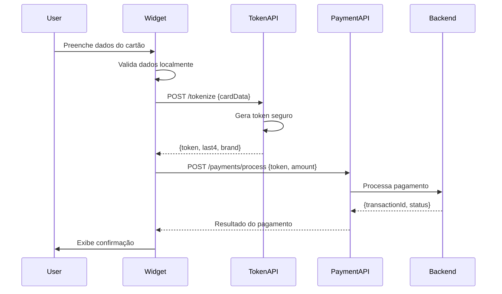

# Formulário de Pagamento - PaymentFormStep

Documentação completa do componente de formulário de pagamento com tokenização de cartão de crédito.

## 📋 Índice

- [Visão Geral](#visão-geral)
- [Funcionalidades](#funcionalidades)
- [Fluxo de Tokenização](#fluxo-de-tokenização)
- [Validações](#validações)
- [Estrutura do Componente](#estrutura-do-componente)
- [Integração com APIs](#integração-com-apis)
- [Exemplo de Uso](#exemplo-de-uso)
- [Segurança](#segurança)

## Visão Geral

O `PaymentFormStep` é o componente responsável pela captura segura dos dados de cartão de crédito e processamento de pagamentos através de tokenização. Ele implementa todas as melhores práticas de segurança PCI DSS, incluindo:

- ✅ Validação de cartão com algoritmo de Luhn
- ✅ Máscaras automáticas nos campos
- ✅ Detecção automática de bandeira
- ✅ Tokenização antes do envio
- ✅ Nunca armazena dados sensíveis
- ✅ Estados de loading e erro
- ✅ Acessibilidade completa

## Funcionalidades

### 1. Campos de Entrada

```typescript
{
  cardNumber: string; // Número do cartão (13-19 dígitos)
  cardholderName: string; // Nome do titular (mínimo 3 caracteres)
  expiryDate: string; // Data de validade (MM/AA)
  cvv: string; // CVV (3-4 dígitos)
  installments: number; // Número de parcelas (1-12)
}
```

### 2. Máscaras Automáticas

- **Número do Cartão**: `0000 0000 0000 0000`
- **Data de Validade**: `MM/AA`
- **CVV**: `000` ou `0000`

### 3. Detecção de Bandeira

O componente detecta automaticamente a bandeira do cartão:

- 💳 Visa (começa com 4)
- 💳 Mastercard (começa com 51-55 ou 2221-2720)
- 💳 Amex (começa com 34 ou 37)
- 💳 Discover (começa com 6011, 622126-622925, 644-649, 65)
- 💳 JCB (começa com 3528-3589)

## Fluxo de Tokenização



## Validações

### Validação de Número do Cartão

```typescript
// 1. Verifica se não está vazio
// 2. Verifica tamanho (13-19 dígitos)
// 3. Aplica algoritmo de Luhn

const isValidLuhn = (cardNumber: string): boolean => {
  const digits = cardNumber.split("").map(Number);
  let sum = 0;

  for (let i = digits.length - 1; i >= 0; i--) {
    const position = digits.length - 1 - i;
    const isEvenPosition = position % 2 === 1;

    const digit = digits[i];
    const doubledDigit = digit * 2;
    const adjustedDigit = doubledDigit > 9 ? doubledDigit - 9 : doubledDigit;

    sum += isEvenPosition ? adjustedDigit : digit;
  }

  return sum % 10 === 0;
};
```

### Validação de Data de Validade

```typescript
// 1. Formato MM/AA válido
// 2. Mês entre 01 e 12
// 3. Data não expirada

const validateExpiryDate = (expiryDate: string): string | null => {
  if (!expiryDate) return "Data de validade é obrigatória";

  const [month, year] = expiryDate.split("/");
  const monthNum = parseInt(month, 10);
  const yearNum = 2000 + parseInt(year, 10);

  if (monthNum < 1 || monthNum > 12) {
    return "Mês inválido";
  }

  const expiryDateObj = new Date(yearNum, monthNum - 1);
  const now = new Date();

  if (expiryDateObj < now) {
    return "Cartão expirado";
  }

  return null;
};
```

### Validação de CVV

```typescript
// 1. Não vazio
// 2. Entre 3 e 4 dígitos

const validateCvv = (cvv: string): string | null => {
  if (!cvv) return "CVV é obrigatório";
  if (cvv.length < 3 || cvv.length > 4) return "CVV inválido";
  return null;
};
```

## Estrutura do Componente

```typescript
export function PaymentFormStep({ onNext, onPrev, config }: StepProps) {
  // Estado do formulário
  const [formData, setFormData] = useState<CardFormData>({...});
  const [errors, setErrors] = useState<CardFormErrors>({});
  const [isLoading, setIsLoading] = useState(false);
  const [cardBrand, setCardBrand] = useState<string>("unknown");

  // Funções de validação
  const validateCardNumber = (cleanCardNumber: string): string | null => {...};
  const validateCardholderName = (name: string): string | null => {...};
  const validateExpiryDate = (expiryDate: string): string | null => {...};
  const validateCvv = (cvv: string): string | null => {...};
  const validateForm = (): boolean => {...};

  // Algoritmo de Luhn
  const isValidLuhn = (cardNumber: string): boolean => {...};

  // Handlers
  const updateField = (field: keyof CardFormData, value: string | number) => {...};
  const handleSubmit = async (e: React.FormEvent) => {...};

  // APIs
  const tokenizeCard = async (): Promise<TokenResult> => {...};
  const processPayment = async (token: string): Promise<PaymentResult> => {...};

  return (
    <form onSubmit={handleSubmit}>
      {/* Campos de entrada */}
      {/* Botões de navegação */}
    </form>
  );
}
```

## Integração com APIs

### 1. Tokenização do Cartão

**Endpoint**: `POST {apiBaseUrl}/tokenize`

**Request**:

```json
{
  "cardNumber": "4111111111111111",
  "cvv": "123",
  "expiryMonth": "12",
  "expiryYear": "25",
  "cardholderName": "JOHN DOE"
}
```

**Response**:

```json
{
  "success": true,
  "token": "tok_xxxxxxxxxxx",
  "card": {
    "last4": "1111",
    "brand": "visa",
    "expiryMonth": "12",
    "expiryYear": "25"
  }
}
```

### 2. Processamento do Pagamento

**Endpoint**: `POST {apiBaseUrl}/payments/process`

**Request**:

```json
{
  "token": "tok_xxxxxxxxxxx",
  "merchantId": "mch_123",
  "amount": 10000,
  "installments": 1
}
```

**Response**:

```json
{
  "success": true,
  "transactionId": "txn_abc123",
  "status": "approved",
  "amount": 10000,
  "installments": 1
}
```

## Exemplo de Uso

### 1. Uso Básico

```tsx
<PaymentFormStep
  onNext={(step) => console.log("Próximo:", step)}
  onPrev={() => console.log("Voltar")}
  config={{
    merchantId: "mch_123",
    apiBaseUrl: "/api",
    onSuccess: (result) => {
      console.log("Pagamento aprovado:", result.transactionId);
    },
    onError: (error) => {
      console.error("Erro:", error.message);
    },
  }}
/>
```

### 2. Com Backend Customizado

```tsx
<PaymentFormStep
  config={{
    merchantId: "mch_123",
    apiBaseUrl: "https://api.meubackend.com",
    onSuccess: async (result) => {
      await savePurchase(result);
      showSuccessMessage();
    },
    onError: async (error) => {
      await logError(error);
      showErrorMessage(error.message);
    },
  }}
  onNext={(step) => navigateToStep(step)}
  onPrev={() => navigateToPreviousStep()}
/>
```

### 3. Múltiplos Comerciantes

```tsx
const merchants = ["mch_001", "mch_002", "mch_003"];

{
  merchants.map((merchantId) => (
    <PaymentFormStep
      key={merchantId}
      config={{
        merchantId,
        apiBaseUrl: "/api",
        // callbacks...
      }}
      // handlers...
    />
  ));
}
```

## Segurança

### ✅ Boas Práticas Implementadas

1. **Nunca Armazena Dados Sensíveis**

   - Dados do cartão são tokenizados imediatamente
   - Token é usado para processamento
   - Dados originais nunca são salvos

2. **Validação em Múltiplas Camadas**

   - Frontend: Validação UX e formato
   - Backend: Validação de negócio
   - Gateway: Validação final e processamento

3. **HTTPS Obrigatório**

   - Todas as comunicações devem usar HTTPS
   - Nunca envie dados de cartão via HTTP

4. **Logging Seguro**

   ```typescript
   logger.info("[Payment] Token gerado:", tokenResult.token);
   // ✅ Loga apenas o token (seguro)
   // ❌ NUNCA logue dados do cartão completo
   ```

5. **Estados de Erro Informativos**
   - Mensagens claras para o usuário
   - Sem expor detalhes técnicos
   - Logging detalhado para debug

### 🚫 O Que NUNCA Fazer

```typescript
// ❌ NUNCA armazene dados de cartão em localStorage/sessionStorage
localStorage.setItem('cardNumber', formData.cardNumber);

// ❌ NUNCA envie dados de cartão para analytics
analytics.track('payment', { cardNumber: '...' });

// ❌ NUNCA logue dados sensíveis
console.log('Card:', formData.cardNumber, formData.cvv);

// ❌ NUNCA armazene em cookies
document.cookie = `card=${cardNumber}`;

// ❌ NUNCA use HTTP para APIs de pagamento
fetch('http://api.example.com/tokenize', {...});
```

### ✅ Checklist de Segurança

Antes de colocar em produção:

- [ ] APIs usam HTTPS exclusivamente
- [ ] Tokens expiram após uso único
- [ ] Backend valida merchant_id
- [ ] Logs não contêm dados sensíveis
- [ ] Rate limiting configurado
- [ ] CORS configurado corretamente
- [ ] CSP headers implementados
- [ ] Certificado SSL válido
- [ ] 3DS implementado (opcional mas recomendado)
- [ ] Monitoramento de fraude ativo

## Callbacks e Eventos

### onSuccess

Chamado quando o pagamento é aprovado com sucesso:

```typescript
config.onSuccess({
  transactionId: "txn_abc123",
  token: "tok_xxxxx",
  merchantId: "mch_123",
  installments: 3,
  timestamp: "2024-01-15T10:30:00.000Z",
});
```

### onError

Chamado quando ocorre um erro:

```typescript
config.onError({
  code: "PAYMENT_ERROR",
  message: "Cartão recusado",
});
```

Códigos de erro comuns:

- `PAYMENT_ERROR`: Erro genérico de pagamento
- `INVALID_CARD`: Cartão inválido
- `EXPIRED_CARD`: Cartão expirado
- `INSUFFICIENT_FUNDS`: Saldo insuficiente
- `NETWORK_ERROR`: Erro de conexão

## Performance

### Otimizações Implementadas

1. **Validação Assíncrona**: Apenas quando necessário
2. **Debounce em Inputs**: Evita validações excessivas
3. **Estados Locais**: Renderização eficiente
4. **Máscaras Otimizadas**: Aplicadas apenas no input

### Métricas Esperadas

- Tempo de validação: < 10ms
- Tempo de tokenização: 200-500ms
- Tempo de processamento: 1-3s
- Bundle size: ~8KB (gzipped)

## Acessibilidade

### WCAG 2.1 AA Compliance

- ✅ Labels descritivos em todos os campos
- ✅ Mensagens de erro anunciadas por screen readers
- ✅ Navegação por teclado completa
- ✅ Contraste de cores adequado
- ✅ Estados de foco visíveis
- ✅ Autocomplete correto (cc-number, cc-name, etc)
- ✅ ARIA labels quando necessário

### Testes de Acessibilidade

```bash
# Lighthouse
npm run lighthouse

# axe-core
npm run test:a11y

# Manual testing
# - Navegação apenas com teclado
# - Screen reader (NVDA/JAWS/VoiceOver)
# - Zoom 200%
# - Modo de alto contraste
```

## Testes

### Números de Teste

Para desenvolvimento e testes:

```
Visa:       4111 1111 1111 1111
Mastercard: 5555 5555 5555 4444
Amex:       3782 822463 10005
Discover:   6011 1111 1111 1117

CVV:        Qualquer 3 dígitos (123)
Validade:   Qualquer data futura (12/25)
```

### Cenários de Teste

1. ✅ Cartão válido → Pagamento aprovado
2. ✅ Cartão expirado → Erro de validação
3. ✅ CVV inválido → Erro de validação
4. ✅ Nome curto → Erro de validação
5. ✅ Número inválido (Luhn) → Erro de validação
6. ✅ API offline → Erro de rede
7. ✅ Pagamento recusado → Mensagem de erro

## Troubleshooting

### Problema: Tokenização falhando

```typescript
// Verificar configuração
console.log(config?.apiBaseUrl); // Deve estar definido

// Verificar CORS
// Headers necessários no backend:
// Access-Control-Allow-Origin: *
// Access-Control-Allow-Methods: POST
// Access-Control-Allow-Headers: Content-Type
```

### Problema: Validação não funcionando

```typescript
// Verificar máscaras
import { cleanValue } from "../../utils/masks";
const clean = cleanValue(formData.cardNumber);
console.log(clean); // Deve retornar apenas números
```

### Problema: Loading infinito

```typescript
// Verificar try/catch no handleSubmit
try {
  await tokenizeCard();
} catch (error) {
  console.error(error);
} finally {
  setIsLoading(false); // ✅ Sempre execute
}
```

## Roadmap

### Próximas Funcionalidades

- [ ] Salvar cartão (com tokenização)
- [ ] Múltiplos cartões
- [ ] PIX integration
- [ ] Boleto bancário
- [ ] 3D Secure (3DS)
- [ ] Apple Pay / Google Pay
- [ ] Detecção de fraude client-side
- [ ] Testes A/B de conversão

## Recursos Adicionais

- [Documentação de Segurança](./SEGURANCA-E-SECRETS.md)
- [Guia de Tokenização](./TOKENIZACAO.md)
- [API Reference](./API-REFERENCE.md)
- [Exemplos de Integração](../examples/)

---

**Última atualização**: Janeiro 2024  
**Versão**: 2.0.0  
**Autor**: Cartão Simples Team
